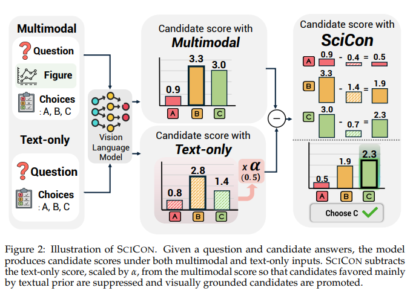

# Scicon

Code for scientific figure multiple-choice QA with contrastive decoding.

This repository currently provides a lightweight evaluation release built around:

- `src/run_always_contrastive_all_candidate.py`

The script runs multiple-choice prediction on scientific figure QA benchmarks through an OpenAI-compatible vision-language model endpoint such as `sglang` or `vLLM`.

## What Is Included

- evaluation script for contrastive decoding over answer candidates
- automatic dataset path discovery under `data/`
- support for `mac`, `scifi`, and `mmsci`
- OpenAI-compatible API inference

## What Is Not Included

- dataset files
- model weights
- training code
- built-in model serving

## Data

This repository does not bundle the datasets. If you want to run the released script on the same benchmarks, use the following dataset repositories:

- https://huggingface.co/datasets/mhjiang0408/MAC_Bench
- https://huggingface.co/datasets/jonathan-roberts1/SciFIBench
- https://huggingface.co/datasets/MMSci/NatureCommsCorpus

Place the prepared files under `data/`. The script will try to auto-detect standard layouts, and you can also pass paths manually through command-line arguments.

Example layout:

```text
data/
  MAC_Bench/
    test.jsonl
  images/
    MAC_Bench/
      ...
  scifi/
    test.parquet
  mmsci/
    test.json
    images/
      ...
```

## Setup

```bash
python -m venv .venv
source .venv/bin/activate
pip install -r requirements.txt
```

## Quick Start

Run against any OpenAI-compatible VLM endpoint:

```bash
python src/run_always_contrastive_all_candidate.py \
  --dataset mac \
  --api-base http://127.0.0.1:30000/v1 \
  --output-jsonl results/mac_predictions.jsonl
```

Supported datasets:

- `mac`
- `scifi`
- `mmsci`

If `--api-model` is not provided, the script tries to auto-detect it from `/v1/models`.

## Serving Backends

The script expects an OpenAI-compatible API for a vision-language model.

Typical options:

- `sglang`
- `vLLM`
- other compatible servers exposing `/v1/models` and chat/completions APIs

### Example: `sglang`

```bash
python src/run_always_contrastive_all_candidate.py \
  --dataset mac \
  --api-base http://127.0.0.1:30000/v1 \
  --output-jsonl results/mac_predictions.jsonl
```

### Example: `vLLM`

```bash
python src/run_always_contrastive_all_candidate.py \
  --dataset scifi \
  --api-base http://127.0.0.1:8000/v1 \
  --api-model your-vlm-name \
  --output-jsonl results/scifi_predictions.jsonl
```

Notes:

- the served model must support image input
- if `/v1/models` is unavailable or empty, set `--api-model` explicitly
- some VLMs need serving-side options such as chat templates or multimodal limits

## More Examples

Smoke test on a small subset:

```bash
python src/run_always_contrastive_all_candidate.py \
  --dataset mac \
  --api-base http://127.0.0.1:30000/v1 \
  --max-samples 10 \
  --output-jsonl results/mac_smoke.jsonl
```

Explicit MMSci paths:

```bash
python src/run_always_contrastive_all_candidate.py \
  --dataset mmsci \
  --input-mmsci-json data/mmsci/test.json \
  --image-root data/mmsci/images \
  --api-base http://127.0.0.1:30000/v1 \
  --output-jsonl results/mmsci_predictions.jsonl
```

## Output

By default, outputs are written to:

```text
results/<dataset>_predictions.jsonl
```

Override this with `--output-jsonl` if needed.

---

## Method Overview

<p align="center">
  
</p>

SciCon is a simple contrastive decoding method for scientific figure multiple-choice QA.

- The model first scores each answer candidate with the full multimodal input.
- It then scores the same candidates again using a text-only version of the question.
- SciCon subtracts the text-only prior, scaled by `alpha`, from the multimodal score.
- This suppresses answers that are mainly favored by textual bias and promotes answers grounded in the figure.

In short, SciCon turns answer choices into an explicit prior and removes that prior during decoding so that the final prediction relies more on visual evidence.

---

## Citation

If you use this repository in your research, please cite:

```bibtex
@article{roh2026choices,
  title={When Choices Become Priors: Contrastive Decoding for Scientific Figure Multiple-Choice QA},
  author={Roh, Taeyun and Jo, Eun-yeong and Jang, Wonjune and Kang, Jaewoo},
  journal={arXiv preprint arXiv:2603.28026},
  year={2026}
}
```

---

## Paper

<p align="center">
  <strong>When Choices Become Priors: Contrastive Decoding for Scientific Figure Multiple-Choice QA</strong><br>
  Taeyun Roh, Eun-yeong Jo, Wonjune Jang, Jaewoo Kang
</p>

This repository contains the evaluation code accompanying the paper and is intended as a lightweight research release for scientific figure multiple-choice QA.
